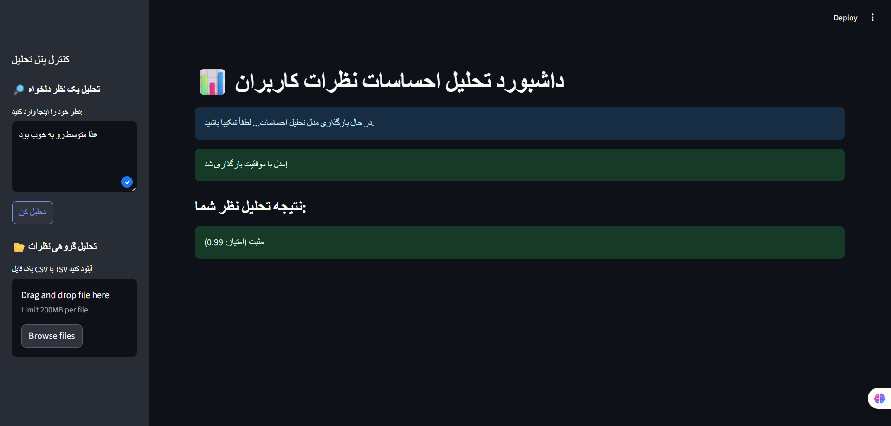

# 📊 داشبورد تحلیل احساسات نظرات کاربران (پروژه دوره ارشد NLP)


این پروژه یک سیستم کامل برای **تحلیل احساسات (Sentiment Analysis)** نظرات کاربران به زبان فارسی است. هدف اصلی پروژه، ساخت یک داشبورد تعاملی است که بتواند نظرات را به صورت تکی یا گروهی تحلیل کرده و نتایج را به صورت بصری نمایش دهد.

این پروژه به عنوان بخشی از دوره کارشناسی ارشد در رشته **پردازش زبان طبیعی (NLP)** توسعه داده شده است و بر روی شخصی‌سازی (Fine-tuning) مدل **DistilBERT** تمرکز دارد.

## 🌟 ویژگی‌های کلیدی

  - **مدل شخصی‌سازی شده**: Fine-tuning مدل `DistilBERT` فارسی بر روی مجموعه داده بزرگ نظرات اسنپ‌فود.
  - **داشبورد تعاملی**: رابط کاربری زیبا و کاربردی با استفاده از فریمورک `Streamlit`.
  - **تحلیل در لحظه**: قابلیت تحلیل یک نظر به صورت آنی و نمایش نتیجه.
  - **پردازش گروهی**: امکان آپلود فایل `CSV` یا `TSV` برای تحلیل هزاران نظر به صورت یکجا.
  - **بصری‌سازی نتایج**: نمایش توزیع احساسات (مثبت/منفی) در قالب نمودار میله‌ای.

## 📸 پیش‌نمایش داشبورد

(در اینجا یک اسکرین‌شات یا GIF جذاب از داشبورد نهایی خود قرار دهید)

-----

## 🏗️ معماری پروژه

پروژه دارای یک ساختار ماژولار و تمیز است که توسعه و نگهداری آن را ساده می‌کند.

```
sentiment-analysis-dashboard/
│
├── data/
│   └── raw/
│       └── Snappfood - Sentiment Analysis.csv
│
├── models/
│   ├── base-distilbert-fa/              # فایل‌های مدل پایه دانلود شده
│   └── distilbert-fa-sentiment-fine-tuned/ # مدل نهایی آموزش‌دیده
│
├── src/
│   └── sentiment_model.py               # ماژول بارگذاری مدل و تحلیل
│
├── dashboard/
│   └── app.py                           # فایل اصلی داشبورد Streamlit
│
├── train.py                             # اسکریپت آموزش و Fine-tuning مدل
├── test_examples.py                     # اسکریپت برای تست مدل با مثال
├── requirements.txt                     # لیست تمام کتابخانه‌های مورد نیاز
└── README.md                            # مستندات پروژه
```

-----

## 🛠️ تکنولوژی‌های استفاده شده

  - **زبان برنامه‌نویسی**: Python 3.9+
  - **یادگیری عمیق و NLP**:
      - `PyTorch`: فریمورک اصلی یادگیری عمیق.
      - `Transformers`: برای بارگذاری، آموزش و استفاده از مدل‌های ترنسفورمر.
      - `Datasets`: برای مدیریت و پردازش بهینه مجموعه داده.
      - `Accelerate`: برای بهینه‌سازی و تسریع فرآیند آموزش.
      - `Evaluate`: برای محاسبه معیارهای ارزیابی مدل.
  - **داشبورد و وب**: `Streamlit`
  - **مدیریت داده**: `Pandas`

-----

## 🚀 نصب و راه‌اندازی

برای اجرای این پروژه در سیستم خود، مراحل زیر را دنبال کنید.

**۱. کلون کردن ریپازیتوری:**

```bash
git clone git@github.com:DanialMasghati/sentiment-analysis-dashboard.git
cd sentiment-analysis-dashboard
```

**۲. ساخت و فعال‌سازی محیط مجازی:**

```bash
# ساخت محیط
python -m venv venv

# فعال‌سازی در ویندوز
venv\Scripts\activate

# فعال‌سازی در مک/لینوکس
source venv/bin/activate
```

**۳. نصب کتابخانه‌های مورد نیاز:**

```bash
pip install -r requirements.txt
```

*(توجه: اگر از GPU انویدیا استفاده می‌کنید، مطمئن شوید نسخه مناسب PyTorch با پشتیبانی از CUDA نصب شده باشد.)*

-----

## 📈 نحوه استفاده

پروژه دارای دو بخش اصلی است: آموزش مدل و اجرای داشبورد.

### آموزش مجدد مدل (اختیاری)

مدل آموزش‌دیده در پوشه `models` قرار دارد. اما اگر قصد دارید مدل را مجدداً با پارامترهای متفاوت آموزش دهید:

1.  فایل‌های مدل پایه (`distilbert-fa-zwnj-base`) را دانلود کرده و در پوشه `models/base-distilbert-fa` قرار دهید.
2.  اسکریپت آموزش را اجرا کنید:
    ```bash
    python train.py
    ```

### اجرای داشبورد

برای اجرای داشبورد تعاملی، دستور زیر را اجرا کنید:

```bash
streamlit run dashboard/app.py
```

سپس مرورگر خود را باز کرده و به آدرس `http://localhost:8501` بروید.

-----

## 🎯 مدل و نتایج آموزش

  - **مدل پایه**: `HooshvareLab/distilbert-fa-zwnj-base`
  - **مجموعه داده**: نظرات کاربران اسنپ‌فود (حدود ۷۰ هزار نظر)
  - **فرآیند**: مدل به مدت **۳ دوره (Epochs)** با پارامترهای بهینه‌سازی شده (مانند `learning_rate=2e-5` و `batch_size=32`) آموزش داده شد.
  - **نتیجه نهایی**: بهترین مدل ذخیره شده به دقت **\~۸۷.۲٪** بر روی مجموعه داده اعتبارسنجی دست یافت.

-----

## 📄 لایسنس

این پروژه تحت لایسنس MIT منتشر شده است. برای جزئیات بیشتر به فایل `LICENSE` مراجعه کنید.

